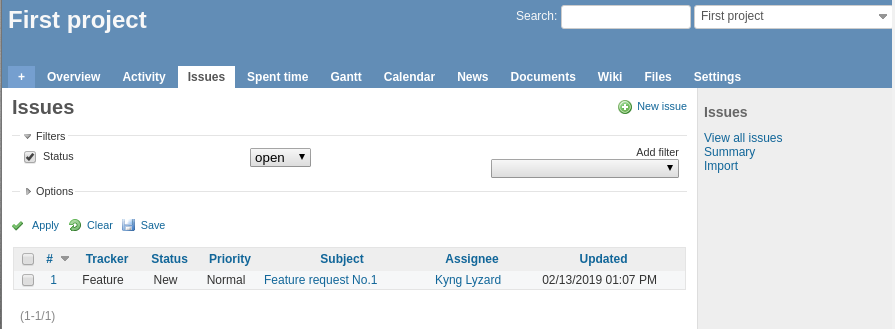
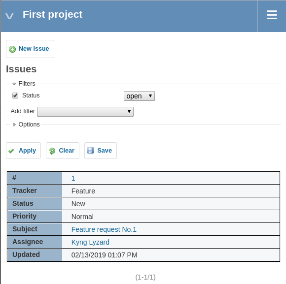

# Responsive Redmine tables

Plugin for transforming tables into responsive (small screen fit) design.

Original issues list:


Responsive issues list:


Plugin is designed to use with **default Redmine theme** having `min-width: 900px;`

## Installation

Standard Redmine plugin installation

```
cd {REDMINE_ROOT}
git clone https://github.com/yzzy/responsive_redmine_tables.git plugins/responsive_redmine_tables
```

## Removal

Just delete cloned directory and restart Redmine web server.

## License

This project is licensed under the terms of the MIT license.

## Credits

Idea of this plugin belongs to @acosonic.
Table transformation principle by Jean-Baptiste Letaconnoux.
